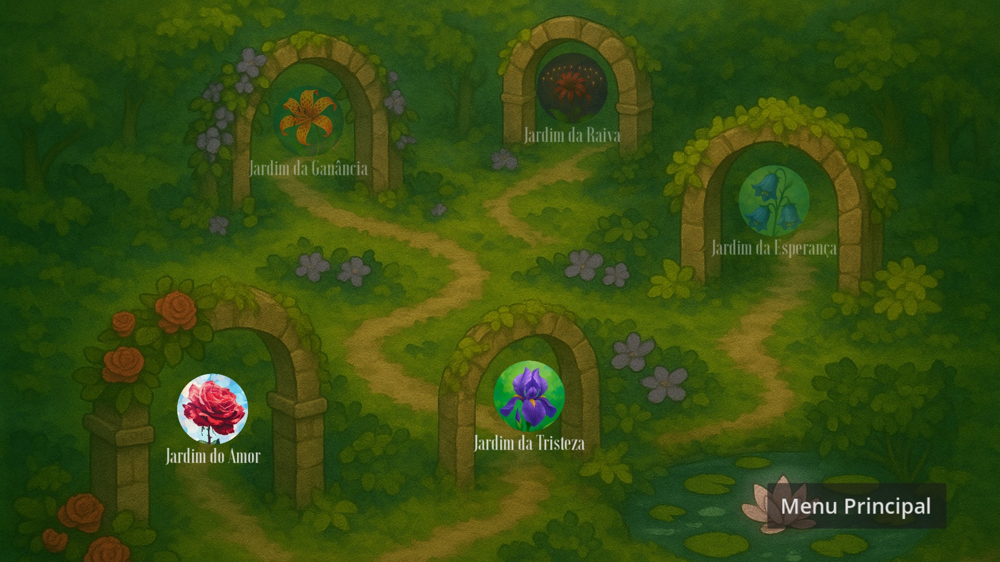

<strong>Um jogo de cartas PvE onde os jogadores exploram um jardim mágico em apuros, enfrentando desafios temáticos baseados na linguagem das flores.</strong>

Cada carta representa uma flor com significado simbólico ou um elemento do jardim, e conta parte da história da protagonista, que precisa atravessar cinco regiões para recuperar o lírio do vale e voltar para casa.

<h3> Equipe de Desenvolvimento</h3>
<ul>
  <li><strong>Ana Liz Bomfim Gomes</strong> – Game Design</li>
  <li><strong>João Pedro Constantino</strong> – Ilustração</li>
  <li><strong>João Pedro Gonçalves</strong> – Programação e Trilha Sonora</li>
  <li><strong>Mateus Silva de Sousa</strong> – Ilustração</li>
</ul>

<h3>Galeria</h3>

<figure>
  
</figure>

<figure>
  
</figure>

<figure>
  
</figure>

<figure>
  
</figure>

